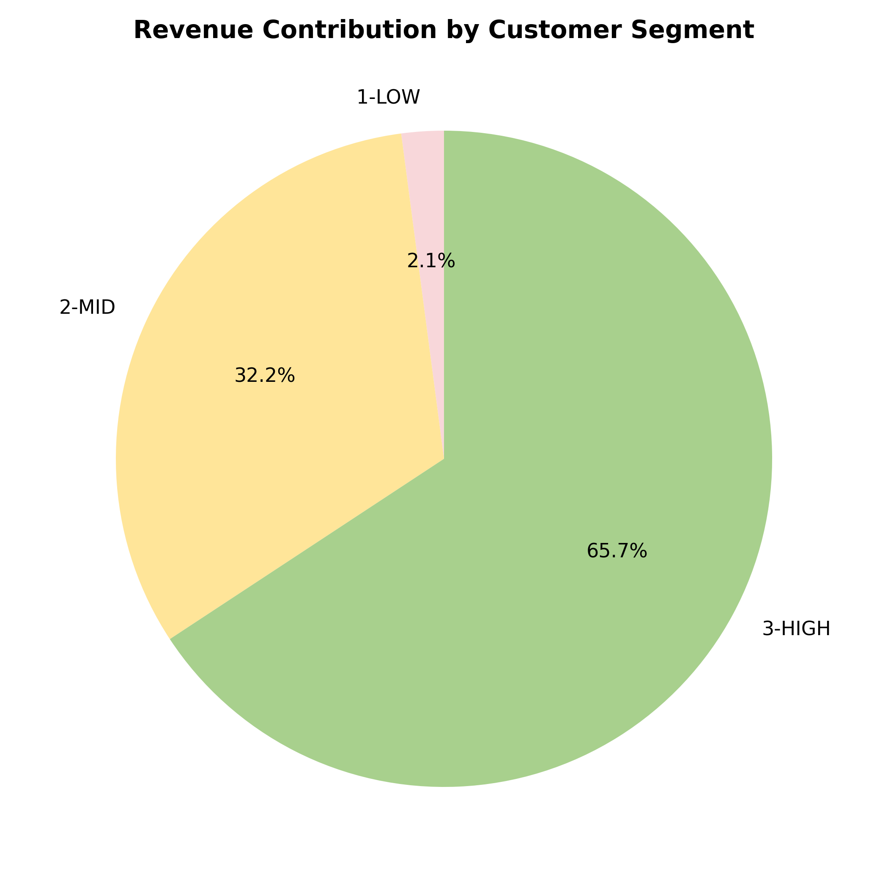
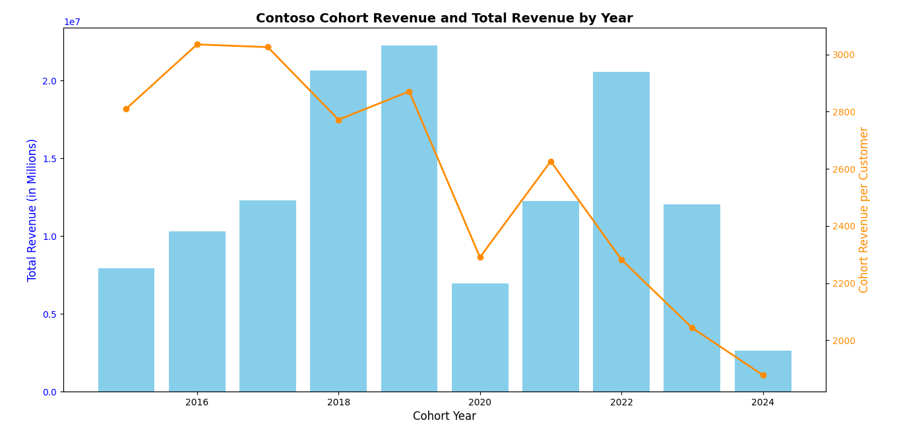
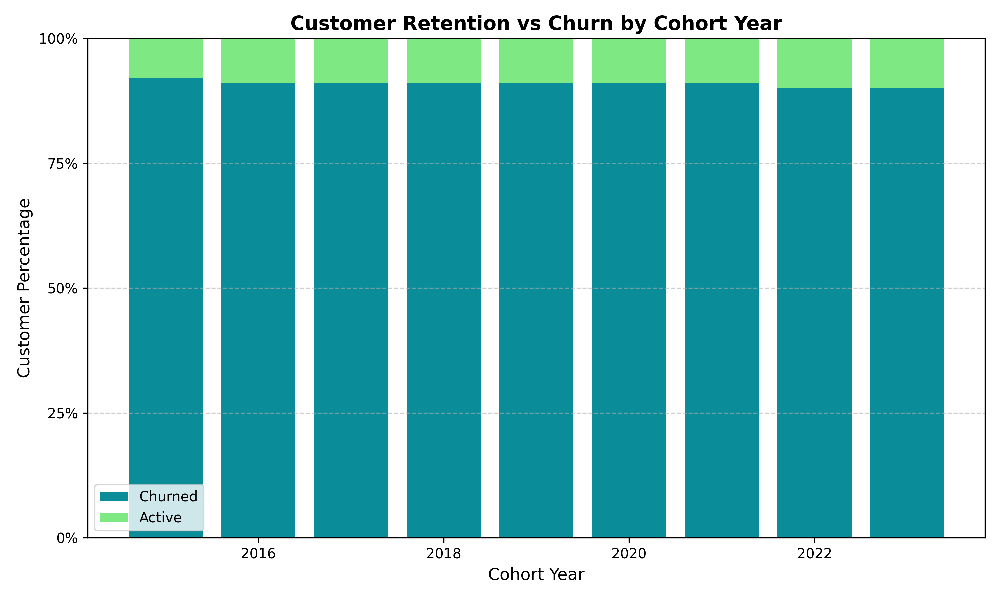

# Contoso Sales Analytics Project
## 🧩 Introduction

In today’s competitive business landscape, understanding customer behavior, value, and retention is essential for sustained growth. This project analyzes the Contoso Sales Dataset to uncover key customer and revenue dynamics through advanced SQL-based cohort and segmentation analyses.

This study explores three major business questions:

1. Customer Segmentation — identifying high-, mid-, and low-value customers based on Lifetime Value (LTV).

2. Cohort Revenue Analysis — evaluating how customer acquisition and spending patterns evolved across cohorts (2015–2024).

3. Customer Retention and Churn Analysis — measuring the proportion of Active vs. Churned customers within each cohort.

Together, these analyses provide a holistic view of customer lifecycle behavior — from acquisition to retention — enabling data-driven decision-making and strategic planning for long-term profitability.

The goal of this project is to help businesses:

- Identify which customer groups drive the most value.

- Understand when and why customers stop purchasing.

- Design actionable strategies to boost engagement, retention, and revenue efficiency.

## ⚙️ Tools and Technologies Used

- **PostgreSQL** – For data querying, transformation, and analysis.
- **Visual Studio Code** – For writing and managing SQL queries.
- **DBeaver** -  For writing and managing SQL queries
- **GitHub** – For version control and project showcasing.
- **Dataset Tables:**
  - `customer`
  - `sales`
  - `product`
  - `store`
  - `date`

## 📊 Business Questions

### 1. Customer Segmentation:
Customer segmentation based on total net revenue (LTV – Lifetime Value) using percentile thresholds.

### 🧩 Query Breakdown

#### Step 1 – Base View: cohort_analysis

```sql
CREATE OR REPLACE VIEW public.cohort_analysis AS
WITH revenue_table AS (
  SELECT
    s.customerkey,
    s.orderdate,
    SUM(s.quantity::double precision * s.netprice / s.exchangerate) AS total_net_revenue,
    COUNT(s.orderkey) AS no_of_orders
  FROM sales s
  GROUP BY s.customerkey, s.orderdate
)
SELECT
  rt.customerkey,
  rt.orderdate,
  rt.total_net_revenue,
  rt.no_of_orders,
  MIN(rt.orderdate) OVER (PARTITION BY rt.customerkey) AS first_order_date,
  EXTRACT(YEAR FROM MIN(rt.orderdate) OVER (PARTITION BY rt.customerkey)) AS cohort_year,
  c.countryfull,
  c.age,
  c.givenname,
  c.surname
FROM revenue_table rt
LEFT JOIN customer c ON rt.customerkey = c.customerkey;
```
#### Purpose:

Builds a customer-level dataset linking each customer’s transactions and their first purchase date (used for cohort identification).

#### Step 2 – Compute LTV per Customer
```sql
customer_ltvs AS (
  SELECT 
    ca.customerkey,
    ca.cleaned_name,
    SUM(ca.total_net_revenue) AS customer_ltv
  FROM cohort_analysis ca
  GROUP BY ca.customerkey, ca.cleaned_name
)
```
#### Purpose:

Aggregates all transactions for each customer into their Lifetime Value (LTV) = total net revenue generated.

#### Step 3 – Determine Percentile Thresholds
```sql
segmentation AS (
  SELECT 
    PERCENTILE_CONT(0.25) WITHIN GROUP (ORDER BY customer_ltv) AS ltv_25th_percentile,
    PERCENTILE_CONT(0.75) WITHIN GROUP (ORDER BY customer_ltv) AS ltv_75th_percentile
  FROM customer_ltvs
)
```
#### Purpose:

* Uses SQL’s PERCENTILE_CONT to compute the 25th and 75th percentiles of customer LTV.

* These thresholds will define the LOW, MID, and HIGH segments.
#### Step 4 – Segment Customers
```sql
customers_seg AS (
  SELECT 
    l.*,
    CASE
      WHEN l.customer_ltv <= s.ltv_25th_percentile THEN '1-LOW'
      WHEN l.customer_ltv > s.ltv_75th_percentile THEN '3-HIGH'
      ELSE '2-MID'
    END AS customer_segment
  FROM customer_ltvs l, segmentation s
)
```
#### Purpose:

Categorizes each customer into:

* 1-LOW → bottom 25%

* 2-MID → middle 50%

* 3-HIGH → top 25%

#### Step 5 – Aggregate Segment Insights
```sql
SELECT 
  customer_segment,
  COUNT(customerkey) AS customers_count,
  SUM(customer_ltv) AS total_ltv,
  SUM(customer_ltv)/COUNT(customerkey) AS avg_ltv
FROM customers_seg
GROUP BY customer_segment
ORDER BY customer_segment;
```
#### Purpose:

* Summarizes key metrics per segment:

* Customers count per tier

* Total LTV contribution

| Segment    | Customers Count | Total LTV (Sales) | Average LTV |
| ---------- | --------------: | ----------------: | ----------: |
| **1-LOW**  |          12,372 |         4,298,367 |         347 |
| **2-MID**  |          24,743 |        66,367,810 |       2,682 |
| **3-HIGH** |          12,372 |       135,606,969 |      10,961 |

### 📈 Visualization




## 📊 Analysis

#### 1️⃣ Low-Value Customers (1-LOW)

* Represents: ~25% of total customer base (12,372 out of ~49,000).

* Revenue Contribution: ~2% of total LTV.

* Average LTV: Only $347 per customer — very low spenders.

* Insight: Large in number, but minimal contribution. Possibly one-time or low-engagement buyers.

#### 2️⃣ Mid-Value Customers (2-MID)

* Represents: ~50% of customers (24,743).

* Revenue Contribution: ~32% of total LTV.

* Average LTV: $2,682, meaning moderate engagement and purchasing consistency.

* Insight: This segment drives consistent sales volume — great potential for upselling and loyalty conversion.

#### 3️⃣ High-Value Customers (3-HIGH)

* Represents: ~25% of customers (12,372).

* Revenue Contribution: ~66% of total LTV!

* Average LTV: $10,961 per customer — nearly 32× higher than low-value customers.

* Insight: Classic Pareto principle (80/20 rule) — a small group generates the majority of revenue.

* Losing even a small portion of these customers would significantly impact revenue.

## 🧭 Strategic Recommendations

#### 🎯 For High-Value Customers (Top 25%)

* Implement exclusive loyalty programs (priority service, rewards, early access).

* Use personalized retention campaigns — predictive churn analysis can help identify drop risks.

* Maintain premium experiences — avoid price sensitivity.

#### ⚡ For Mid-Value Customers (Middle 50%)

* Focus on upselling and cross-selling (e.g., complementary products).

* Offer tier-based rewards to incentivize higher spending.

* Send personalized product recommendations based on past behavior.

#### 🪄 For Low-Value Customers (Bottom 25%)

* Run re-engagement campaigns (discounts, first-time bundles).

* Simplify checkout or subscription plans to reduce drop-offs.

* Identify whether they are new or churned users — tailor communication accordingly.

## 2. 🧭 Cohort Revenue Analysis (2015–2024)

This analysis tracks customer acquisition cohorts — grouping customers by their first purchase year — and evaluates the total revenue generated and average revenue per customer within each cohort.
By comparing across years, we can identify how customer acquisition and spending behavior evolved over time.

### ⚙️ Query Logic
```sql
SELECT 
  cohort_year,
  COUNT(DISTINCT customerkey) AS total_customers,
  SUM(total_net_revenue) AS total_revenue,
  SUM(total_net_revenue)/COUNT(DISTINCT customerkey) AS customer_revenue
FROM cohort_analysis
WHERE orderdate = first_order_date
GROUP BY cohort_year;
```
### Explanation:

Each customer’s first_order_date determines their cohort year (first purchase year).

The query calculates:

* 🧍‍♂️ total_customers — unique customers in that cohort

* 💰 total_revenue — total net revenue earned from their first purchase

* 📈 customer_revenue — average revenue per customer (LTV snapshot)

### 📊 Summary Table

| Cohort Year | Total Customers | Total Revenue (USD) | Avg. Revenue per Customer |
| ----------- | --------------- | ------------------- | ------------------------- |
| 2015        | 2,825           | 7,939,067           | 2,810                     |
| 2016        | 3,397           | 10,309,452          | 3,035                     |
| 2017        | 4,068           | 12,308,043          | 3,026                     |
| 2018        | 7,446           | 20,639,179          | 2,772                     |
| 2019        | 7,755           | 22,261,147          | 2,871                     |
| 2020        | 3,031           | 6,942,437           | 2,290                     |
| 2021        | 4,663           | 12,246,413          | 2,626                     |
| 2022        | 9,010           | 20,565,769          | 2,283                     |
| 2023        | 5,890           | 12,036,152          | 2,043                     |
| 2024        | 1,402           | 2,633,485           | 1,878                     |

### 📈 Visualization



### 📈 Insights

**Peak Cohort Years (2018–2019)**

* Highest customer acquisition: ~7,400–7,700 customers.

* Also peak revenue contribution: $20M+ per cohort.

* Suggests strong brand traction and wider market reach during that period.

**Gradual Decline Post-2019**

* Noticeable drop in both new customers and average revenue per user (ARPU) after 2020.

* COVID-19 or shifting business focus could have influenced this downturn.

**Average Revenue per Customer Decreasing**

* From ~$3,000 (2015–2017) to ~$1,800 (2024) — nearly a 40% decline.

* Indicates newer cohorts are contributing less revenue per customer, possibly due to:

* Smaller order sizes

* Discount-heavy acquisition strategies

**Recent Cohorts (2022–2024)**

* Acquisition efforts revived in 2022 (9K new customers), but spending per user continues to drop.

* Suggests volume-driven growth with limited monetization.

### 🎯 Strategic Recommendations

* **Customer Retention Programs:**
Strengthen post-acquisition engagement — loyalty programs or repeat purchase incentives can increase LTV for newer cohorts.

* **Segment-Based Marketing:**
Focus marketing on cohorts with historically high ARPU (e.g., 2016–2019 customers).

* **Product & Pricing Review:**
Investigate why newer customers are spending less are they buying cheaper SKUs, or has pricing strategy changed?

* **Revive High-Value Behavior:**
Analyze 2016–2019 cohort behaviors (purchase frequency, product mix) to replicate success patterns for new customers.

## 🧭 Customer Retention & Churn Analysis (Cohort-Based)

This analysis evaluates customer retention and churn by cohort year using the Contoso Sales dataset.

**Each customer is assigned a status:**

- Active → Made a purchase within the last 6 months

- Churned → No purchase in the last 6 months

By examining these trends by cohort, we can understand long-term customer engagement and lifetime behavior.

### ⚙️ SQL Logic
```sql
WITH last_orders AS (
    SELECT 
        customerkey,
        orderdate,
        first_order_date,
        cleaned_name,
        cohort_year,
        ROW_NUMBER() OVER(PARTITION BY customerkey ORDER BY orderdate DESC) AS rn
    FROM cohort_analysis
),
customer_status AS (
    SELECT 
        customerkey,
        cleaned_name,
        orderdate,
        CASE 
            WHEN orderdate < (SELECT MAX(orderdate) FROM sales)::date - INTERVAL '6 months' THEN 'Churned'
            ELSE 'Active' 
        END AS status,
        cohort_year
    FROM last_orders
    WHERE rn = 1
      AND first_order_date < (SELECT MAX(orderdate) FROM sales)::date - INTERVAL '6 months'
)
SELECT 
    cohort_year,
    status,
    COUNT(customerkey) AS number_of_customers,
    SUM(COUNT(customerkey)) OVER (PARTITION BY cohort_year) AS customers_total,
    ROUND(COUNT(customerkey)::numeric / SUM(COUNT(customerkey)) OVER (PARTITION BY cohort_year), 2) AS customers_percentage
FROM customer_status  
GROUP BY cohort_year, status;
```

### Key logic:

- Uses ROW_NUMBER() to find the last purchase date per customer.

- Flags customers as Active if they purchased within 6 months of the dataset’s latest order date.

- Groups by cohort_year to compare retention over time.
### 📊 Summary Table

| Cohort Year | Status  | # Customers | % of Total |
| ----------- | ------- | ----------- | ---------- |
| 2015        | Active  | 237         | 8%         |
| 2015        | Churned | 2588        | 92%        |
| 2016        | Active  | 311         | 9%         |
| 2016        | Churned | 3086        | 91%        |
| 2017        | Active  | 385         | 9%         |
| 2017        | Churned | 3683        | 91%        |
| 2018        | Active  | 704         | 9%         |
| 2018        | Churned | 6742        | 91%        |
| 2019        | Active  | 687         | 9%         |
| 2019        | Churned | 7068        | 91%        |
| 2020        | Active  | 283         | 9%         |
| 2020        | Churned | 2748        | 91%        |
| 2021        | Active  | 442         | 9%         |
| 2021        | Churned | 4221        | 91%        |
| 2022        | Active  | 937         | 10%        |
| 2022        | Churned | 8073        | 90%        |
| 2023        | Active  | 455         | 10%        |
| 2023        | Churned | 4263        | 90%        |

### 📈 Visualization



### 📊 Insights

**High Churn Rate Across All Cohorts (90%+):**

* Consistently high churn (≈91%) suggests customers are not staying active beyond initial purchases.

* Indicates weak long-term engagement or lack of repeat-purchase incentives.

**Slight Retention Improvement in 2022–2023:**

* Active customers increased to ~10%, showing early signs of improved engagement.

* Possibly due to newer product lines, promotions, or improved customer experience.

**Older Cohorts (2015–2019) Have Minimal Active Base:**

* Only ~8–9% of early customers remain active.

* Suggests limited success in retaining legacy users — perhaps due to product maturity or market saturation.

**Stable but Low Retention Across Years:**

* While churn doesn’t worsen over time, there’s no substantial improvement either — implying retention strategy stagnation.

### 🎯 Strategic Recommendations

**Implement a Customer Retention Framework:**

- Use CRM data to track post-purchase activity.

- Launch automated re-engagement campaigns targeting inactive users after 3–6 months.

**Introduce Loyalty and Subscription Programs:**

- Reward repeat customers with points, discounts, or exclusive offers.

- This can turn occasional buyers into recurring customers.

**Identify At-Risk Customers Early:**

- Use predictive analytics to detect inactivity trends before churn occurs.

- Offer personalized reactivation incentives.

**Focus on 2022–2023 Cohorts:**

- These groups show better retention potential — invest in converting them into long-term loyal users.

**Product Feedback and Lifecycle Management:**

- Survey churned customers to identify dissatisfaction causes (price, quality, or support).

- Feed insights into product development and marketing.